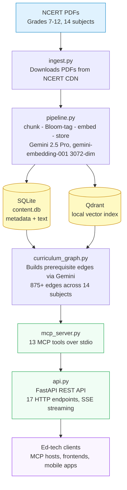
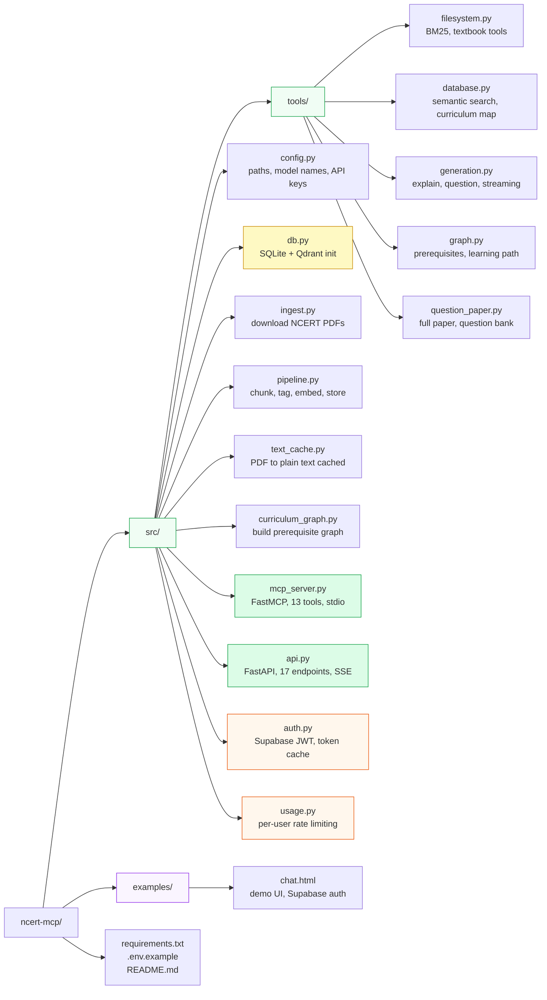

# ncert-mcp

An open-source **Model Context Protocol (MCP) server** and **REST API** that turns the entire NCERT/CBSE curriculum (Grades 7–12) into structured, queryable infrastructure.

Built for ed-tech companies that want to build on top of NCERT content — explanations, question generation, question papers, semantic search, and curriculum graphs — without rebuilding the data pipeline themselves.

---

## What it does

| Capability | Description |
|-----------|-------------|
| **Semantic search** | Vector search over 400k+ NCERT text chunks (Gemini embeddings) |
| **Keyword search** | BM25 search across all chapter PDFs |
| **RAG explanations** | Grade-aware explanations with Markdown structure, LaTeX formulas, Mermaid diagrams, and callout notes |
| **Question generation** | Structured MCQ / SAQ / LAQ with marking schemes, Bloom's tagging |
| **Question papers** | Full CBSE-pattern papers: weekly test → pre-board → board exam |
| **Curriculum graph** | 875+ prerequisite edges across 14 subjects — powers learning paths |
| **Question bank** | Persistent store; questions reused across papers, never re-generated |
| **REST API** | All tools exposed as HTTP endpoints for non-MCP clients |

---

## Architecture



---

## MCP Tools

### Textbook tools (file-system, no DB required)

| Tool | Description |
|------|-------------|
| `tool_list_books` | List available NCERT textbooks, filter by grade/subject |
| `tool_list_topics` | Chapter titles for a textbook |
| `tool_get_chapter` | Full extracted text of one chapter |
| `tool_get_chapter_metadata` | Source URL, download date (fast, no PDF parse) |
| `tool_search_chapters` | BM25 keyword search across all PDFs |

### RAG + generation tools (requires pipeline)

| Tool | Description |
|------|-------------|
| `tool_search_content` | Semantic vector search with grade/subject/Bloom's filters |
| `tool_get_curriculum_map` | Topics + Bloom's distribution by chapter |
| `tool_generate_explanation` | RAG-grounded explanation, grade-stage aware |
| `tool_generate_question` | Single structured question (MCQ/SAQ/LAQ) |
| `tool_generate_question_paper` | Full CBSE-pattern paper (weekly → board exam) |

### Curriculum graph tools (requires curriculum_graph.py)

| Tool | Description |
|------|-------------|
| `tool_get_prerequisites` | Direct prerequisite topics for a given topic |
| `tool_get_learning_path` | Full ordered prerequisite chain, roots first |

---

## REST API Endpoints

| Method | Path | Description |
|--------|------|-------------|
| GET | `/health` | Health check |
| GET | `/books` | List textbooks |
| GET | `/books/{grade}/{subject}/topics` | Chapter list |
| GET | `/books/{grade}/{subject}/chapters/{n}` | Full chapter text |
| GET | `/books/{grade}/{subject}/chapters/{n}/metadata` | Chapter metadata |
| GET | `/search/chapters` | BM25 keyword search |
| GET | `/search/content` | Semantic search |
| GET | `/curriculum/{grade}/{subject}` | Curriculum map |
| POST | `/explain` | Stream explanation (SSE) — Markdown, LaTeX, Mermaid diagram |
| POST | `/question` | Stream question generation (SSE) |
| GET | `/exam-types` | List supported exam types |
| POST | `/question-paper` | Generate full question paper |
| GET | `/graph/prerequisites` | Prerequisite topics |
| GET | `/graph/learning-path` | Full learning path |

Interactive docs: `http://localhost:8000/docs`

---

## Quick start

### Prerequisites

- Python 3.11+
- A [Google AI Studio](https://aistudio.google.com/apikey) API key (Gemini — free tier works for the API, paid recommended for pipeline speed)

### 1. Clone and set up

```bash
git clone https://github.com/your-org/ncert-mcp
cd ncert-mcp

python3 -m venv .venv
source .venv/bin/activate

pip install -r requirements.txt
```

### 2. Configure

```bash
cp .env.example .env
# Edit .env and add your GOOGLE_API_KEY
```

### 3. Run the MCP server (with existing data)

If you have a pre-built `data/` directory (see [Releases](#) for a downloadable snapshot):

```bash
python src/mcp_server.py
```

Configure in Claude Desktop (`~/Library/Application Support/Claude/claude_desktop_config.json`):

```json
{
  "mcpServers": {
    "ncert-mcp": {
      "command": "/path/to/ncert-mcp/.venv/bin/python",
      "args": ["/path/to/ncert-mcp/src/mcp_server.py"],
      "env": {
        "GOOGLE_API_KEY": "<your key>"
      }
    }
  }
}
```

### 4. Run the REST API

```bash
uvicorn src.api:app --reload --port 8000
```

---

## Building the data pipeline from scratch

> **Time estimate:** ~90 minutes total. The pipeline calls Gemini 2.5 Pro per chapter (~35s each, 145 chapters).

### Step 1 — Ingest NCERT PDFs

```bash
python src/ingest.py
```

Downloads all NCERT textbook PDFs (Grades 7–12, 9 subjects) to `data/raw/ncert_pdfs/`. Safe to re-run — already-downloaded files are skipped.

### Step 2 — Chunk → Tag → Embed → Store

```bash
python src/pipeline.py
```

Reads text cache → chunks (512 tokens, 64 overlap) → tags with Gemini (Bloom's level, topic, difficulty) → embeds with `gemini-embedding-001` (3072-dim) → stores in SQLite + Qdrant.

Idempotent — already-processed chapters are skipped automatically.

### Step 3 — Build the curriculum graph

```bash
python src/curriculum_graph.py
```

Calls Gemini once per subject to identify prerequisite edges between topics. Produces 800+ edges across all subjects. Safe to re-run.

---

## Explanation response format

`POST /explain` streams SSE events. Each chunk event carries a piece of the explanation text. The final `done` event carries metadata:

```json
{ "type": "chunk", "text": "## Photosynthesis\n\nPlants use **chlorophyll**..." }
{ "type": "done",
  "source_chunks": ["grade_7_science_ch1[4]", "..."],
  "model_used": "gemini-2.0-flash",
  "stage": "Middle",
  "mermaid_diagram": "flowchart TD\n  sunlight --> ...",
  "mermaid_caption": "Photosynthesis process"
}
```

The explanation text is structured Markdown:

| Element | Syntax | Rendered as |
|---------|--------|-------------|
| Section headings | `## Heading` | Bold section title |
| Key vocabulary | `**term**` | Bold on first use |
| Steps / sequences | `1. step` | Numbered list |
| Types / properties | `- item` | Bullet list |
| Important reminders | `> **Note:** ...` | Blue callout box |
| Worked examples | `> **Example:** ...` | Green callout box |
| Comparisons | `\| col \| col \|` | Table |
| Inline formula | `$E = mc^2$` | KaTeX rendered |
| Display equation | `$$F = ma$$` | KaTeX block |

`mermaid_diagram` is only present for process/cycle/hierarchy topics (e.g. photosynthesis, water cycle, food chain). It is `null` for definitions and static facts.

---

## Exam types for question paper generation

| Type | Marks | Duration | Structure |
|------|-------|----------|-----------|
| `class_test` | 20 | 40 min | 10 MCQ + 5 SAQ |
| `weekly_test` | 25 | 45 min | 10 MCQ + 5 SAQ (3 marks) |
| `monthly_test` | 50 | 90 min | MCQ + SAQ + LAQ |
| `mid_term` | 80 | 3 hr | Full 5-section CBSE pattern |
| `pre_board` | 80 | 3 hr | Full pattern, harder difficulty mix |
| `board` | 80 | 3 hr | Strict CBSE board pattern |

Bloom's distribution is automatically enforced per CBSE norms (Remember 10–15%, Apply 25–30%, etc.).

Example:
```bash
curl -s -X POST http://localhost:8000/question-paper \
  -H "Content-Type: application/json" \
  -d '{
    "grade": 10,
    "subject": "Science",
    "exam_type": "pre_board",
    "chapters": [1, 2, 3, 4, 5],
    "include_answer_key": true
  }'
```

---

## Pedagogical stage awareness

Explanations auto-adjust to the student's NCF 2023 stage:

| Grades | Stage | Tone |
|--------|-------|------|
| 6–8 | Middle | Activity-based, Indian daily-life examples |
| 9–10 | Secondary | Formal, exam-pattern aware, NCERT-style |
| 11–12 | Higher Secondary | Analytical, derivations, JEE/NEET aligned |

---

## Project structure



---

## Tech stack

| Layer | Choice | Why |
|-------|--------|-----|
| MCP server | FastMCP (Python) | Simplest stdio MCP; works with Claude Desktop + Claude Code |
| REST API | FastAPI + uvicorn | Async, auto-docs, streaming responses |
| Vector DB | Qdrant (local) | No Docker needed for local dev; same API for cloud |
| Metadata DB | SQLite | Zero install; PostgreSQL-compatible schema for prod |
| Embeddings | `gemini-embedding-001` (3072-dim) | Best available on Gemini API |
| Generation | `gemini-2.5-pro` | Thinking mode for tagging accuracy |
| Schema | NCERT Grades 7–12 | 145 chapters, 14 subjects, 9,500+ distinct topics |

---

## Contributing

Pull requests welcome. To add a new subject or extend the schema:

1. Add entries to `NCERT_TEXTBOOK_CHAPTERS` and `CHAPTER_TITLES` in `src/tools/filesystem.py`
2. Re-run `src/ingest.py` to download the new PDFs
3. Re-run `src/pipeline.py` — already-processed chapters are skipped
4. Re-run `src/curriculum_graph.py` — new edges are appended

To add a new MCP tool:
1. Implement the function in the appropriate `src/tools/*.py` file
2. Wrap it with `@mcp.tool()` in `src/mcp_server.py`
3. Add the corresponding endpoint in `src/api.py`

---

## License

MIT
