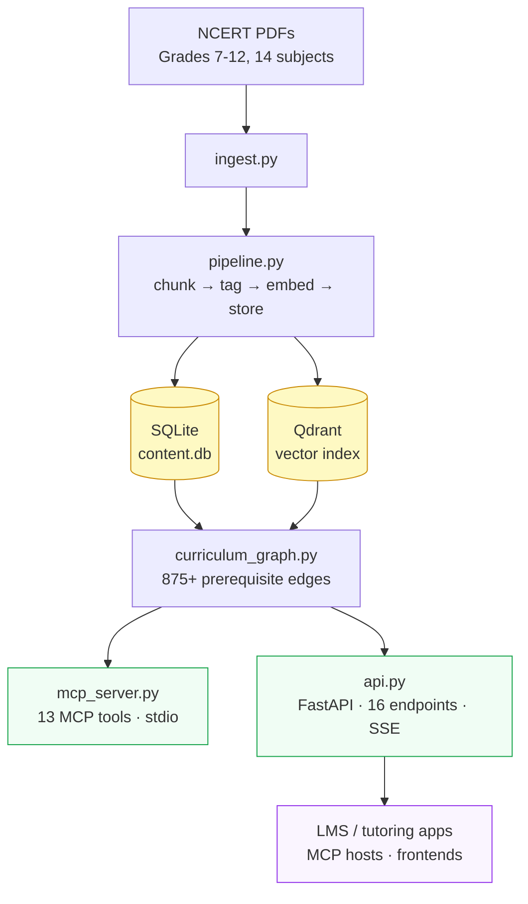

# ncert-mcp

An open-source **MCP server** and **REST API** that turns the entire NCERT/CBSE curriculum (Grades 7–12) into structured, queryable infrastructure.

Built for ed-tech companies — LMS platforms, tutoring apps, teacher tools — that want NCERT-grounded explanations, question generation, question papers, and curriculum graphs without rebuilding the data pipeline.

**Hosted API:** `http://34.171.42.160:8000` · [Interactive docs](http://34.171.42.160:8000/docs)

---

## What it does

| Capability | Description |
|---|---|
| Semantic search | Vector search over NCERT chunks — topic, Bloom's level, difficulty, pre-filled action params |
| Keyword search | BM25 search across all chapter PDFs |
| RAG explanations | Grade-aware explanations — Markdown, LaTeX, Mermaid diagrams. Streams via SSE |
| Question generation | Structured MCQ / SAQ / LAQ with marking schemes and Bloom's tagging. Streams via SSE |
| Question papers | Full CBSE-pattern papers: class test → board exam. Backed by a persistent question bank |
| Curriculum graph | 875+ prerequisite edges across 14 subjects — powers learning paths |
| REST API | All capabilities as HTTP endpoints |
| MCP server | All capabilities as MCP tools for Claude Desktop / Claude Code |

---

## LMS Integration Guide

This section covers how to wire ncert-mcp into a typical LMS: content browsing, search, adaptive explanations, assessments, and curriculum mapping.

### Base URL

```
http://34.171.42.160:8000
```

All endpoints return JSON. Generation endpoints (`/explain`, `/question`) stream [Server-Sent Events (SSE)](#sse-streaming).

---

### 1. Content browser

Let students browse the NCERT curriculum before diving into a topic.

**List all books (with optional filters):**
```http
GET /books?grade=10&subject=Science
```
```json
[
  {
    "grade": 10,
    "subject": "Science",
    "book_code": "jesc1",
    "num_chapters": 13
  }
]
```

**List chapters in a book:**
```http
GET /books/10/Science/topics
```
```json
[
  { "chapter": 1, "title": "Chemical Reactions and Equations" },
  { "chapter": 2, "title": "Acids, Bases and Salts" }
]
```

**Get full chapter text:**
```http
GET /books/10/Science/chapters/1
```

---

### 2. Search

**Semantic search** (recommended for topic discovery and AI features):
```http
GET /search/content?query=photosynthesis&grade=9&subject=Science&top_k=5
```
```json
[
  {
    "score": 0.91,
    "grade": 9,
    "subject": "Science",
    "chapter": 2,
    "topic": "Photosynthesis",
    "bloom_level": "understand",
    "difficulty": "medium",
    "highlight": "Grade 9 Science · Chapter 2 · Topic: Photosynthesis · Understand · Medium",
    "actions": {
      "explain":       { "grade": 9, "subject": "Science", "topic": "Photosynthesis" },
      "question":      { "grade": 9, "subject": "Science", "topic": "Photosynthesis", "bloom_level": "understand", "difficulty": "medium" },
      "learning_path": { "grade": 9, "subject": "Science", "topic": "Photosynthesis" }
    },
    "text": "...(chunk text)..."
  }
]
```

> The `actions` object is pre-filled — pass it directly to `/explain`, `/question`, or `/graph/learning-path`. No extra processing needed.

Optional filters: `grade`, `subject`, `bloom_level` (`remember` | `understand` | `apply` | `analyse` | `evaluate` | `create`), `top_k` (1–20).

**Keyword search** (for exact term matching):
```http
GET /search/chapters?query=mitosis&grade=9&top_k=5
```

---

### 3. Adaptive explanations

Stream a RAG-grounded explanation of any CBSE topic. The explanation is grade-stage aware — vocabulary, examples, and depth automatically adjust.

```http
POST /explain
Content-Type: application/json

{
  "grade": 9,
  "subject": "Science",
  "topic": "Photosynthesis",
  "language": "en"
}
```

Language: `"en"` (default) or `"hi"` for Hindi.

#### SSE streaming

The response is a stream of SSE events. Read it in your frontend:

```js
const res = await fetch('http://34.171.42.160:8000/explain', {
  method: 'POST',
  headers: { 'Content-Type': 'application/json' },
  body: JSON.stringify({ grade: 9, subject: 'Science', topic: 'Photosynthesis' }),
});

const reader = res.body.getReader();
const decoder = new TextDecoder();

while (true) {
  const { done, value } = await reader.read();
  if (done) break;

  const lines = decoder.decode(value).split('\n');
  for (const line of lines) {
    if (!line.startsWith('data: ')) continue;
    const event = JSON.parse(line.slice(6));

    if (event.type === 'chunk') {
      appendToUI(event.text);            // render Markdown incrementally
    } else if (event.type === 'done') {
      console.log('sources:', event.source_chunks);
      if (event.mermaid_diagram) {
        renderMermaid(event.mermaid_diagram, event.mermaid_caption);
      }
    }
  }
}
```

**`chunk` event:**
```json
{ "type": "chunk", "text": "## Photosynthesis\n\nPlants use **chlorophyll**..." }
```

**`done` event:**
```json
{
  "type": "done",
  "source_chunks": ["grade_9_science_ch2[4]", "grade_9_science_ch2[5]"],
  "model_used": "gemini-2.5-pro",
  "stage": "Secondary",
  "mermaid_diagram": "flowchart TD\n  Sunlight --> Chlorophyll\n  ...",
  "mermaid_caption": "Photosynthesis process"
}
```

`mermaid_diagram` is present only for process/cycle/hierarchy topics (photosynthesis, water cycle, food chain). It is `null` for definitions and static facts.

**Explanation text format:**

| Element | Syntax | Render as |
|---|---|---|
| Section headings | `## Heading` | Bold section title |
| Key vocabulary | `**term**` | Bold on first use |
| Steps / sequences | `1. step` | Numbered list |
| Types / properties | `- item` | Bullet list |
| Important notes | `> **Note:** ...` | Callout box |
| Worked examples | `> **Example:** ...` | Callout box |
| Inline formula | `$E = mc^2$` | KaTeX |
| Display equation | `$$F = ma$$` | KaTeX block |

**Pedagogical stage awareness:**

| Grades | Stage | Tone |
|---|---|---|
| 6–8 | Middle | Activity-based, Indian daily-life examples |
| 9–10 | Secondary | Formal, exam-pattern aware, NCERT-style |
| 11–12 | Higher Secondary | Analytical, derivations, JEE/NEET aligned |

---

### 4. Question generation

Stream a single CBSE-style question grounded in NCERT content.

```http
POST /question
Content-Type: application/json

{
  "grade": 10,
  "subject": "Science",
  "topic": "Acids, Bases and Salts",
  "bloom_level": "apply",
  "difficulty": "medium",
  "question_type": "MCQ",
  "marks": 1
}
```

| Field | Options |
|---|---|
| `question_type` | `MCQ` \| `SAQ` \| `LAQ` |
| `bloom_level` | `remember` \| `understand` \| `apply` \| `analyse` \| `evaluate` \| `create` |
| `difficulty` | `easy` \| `medium` \| `hard` |

Same SSE streaming as `/explain`. The `done` event contains the final parsed question:

```json
{
  "type": "done",
  "question": "Which of the following is an example of a neutralization reaction?",
  "options": ["A. ...", "B. ...", "C. ...", "D. ..."],
  "correct_answer": "B",
  "explanation": "...",
  "bloom_level": "apply",
  "marks": 1
}
```

---

### 5. Question paper generation

Generate a complete CBSE-compliant question paper. Questions are sourced from the persistent question bank — never regenerated unnecessarily.

```http
POST /question-paper
Content-Type: application/json

{
  "grade": 10,
  "subject": "Science",
  "exam_type": "monthly_test",
  "chapters": [1, 2, 3],
  "difficulty_mix": { "easy": 0.3, "medium": 0.5, "hard": 0.2 },
  "include_answer_key": true
}
```

`chapters` — omit for full syllabus. `difficulty_mix` — omit for CBSE defaults.

**Exam types:**

| Type | Marks | Duration | Structure |
|---|---|---|---|
| `class_test` | 20 | 40 min | 10 MCQ + 5 SAQ |
| `weekly_test` | 25 | 45 min | 10 MCQ + 5 SAQ (3 marks) |
| `monthly_test` | 50 | 90 min | MCQ + SAQ + LAQ |
| `mid_term` | 80 | 3 hr | Full 5-section CBSE pattern |
| `pre_board` | 80 | 3 hr | Full pattern, harder difficulty mix |
| `board` | 80 | 3 hr | Strict CBSE board pattern |

Bloom's distribution is automatically enforced per CBSE norms (Remember 10–15%, Apply 25–30%, etc.).

**List all exam types with full section structure:**
```http
GET /exam-types
```

---

### 6. Curriculum graph

**Get prerequisites for a topic** (what a student must know first):
```http
GET /graph/prerequisites?topic=Photosynthesis&grade=9&subject=Science
```

**Get the full ordered learning path** (most foundational → target):
```http
GET /graph/learning-path?topic=Photosynthesis&grade=9&subject=Science
```

Use this to build adaptive learning flows: before assigning a topic, check its learning path and surface any prerequisite gaps.

**Curriculum map** (Bloom's distribution by chapter):
```http
GET /curriculum/9/Science
```

---

## API Reference

| Method | Path | Description |
|---|---|---|
| GET | `/` | API metadata |
| GET | `/health` | Liveness check |
| GET | `/docs` | Interactive OpenAPI docs |
| GET | `/books` | List textbooks (`?grade=`, `?subject=`) |
| GET | `/books/{grade}/{subject}/topics` | Chapter list |
| GET | `/books/{grade}/{subject}/chapters/{n}` | Full chapter text |
| GET | `/books/{grade}/{subject}/chapters/{n}/metadata` | Chapter metadata (fast) |
| GET | `/search/chapters` | BM25 keyword search (`?query=`, `?grade=`, `?subject=`, `?top_k=`) |
| GET | `/search/content` | Semantic search (`?query=`, `?grade=`, `?subject=`, `?bloom_level=`, `?top_k=`) |
| GET | `/curriculum/{grade}/{subject}` | Bloom's distribution by chapter |
| POST | `/explain` | Stream explanation (SSE) |
| POST | `/question` | Stream question generation (SSE) |
| GET | `/exam-types` | List exam types |
| POST | `/question-paper` | Generate full question paper |
| GET | `/graph/prerequisites` | Prerequisite topics |
| GET | `/graph/learning-path` | Full learning path |

---

## Self-hosting

### Prerequisites

- Python 3.11+
- [Google AI Studio](https://aistudio.google.com/apikey) API key (Gemini — free tier works for the API, paid recommended for the pipeline)

### Setup

```bash
git clone https://github.com/hatchedland/ncert-mcp
cd ncert-mcp

python3 -m venv .venv
source .venv/bin/activate
pip install -r requirements.txt

cp .env.example .env
# Add your GOOGLE_API_KEY to .env
```

### Run the API

```bash
uvicorn src.api:app --reload --port 8000
```

### Run the MCP server

```bash
python src/mcp_server.py
```

Claude Desktop config (`~/Library/Application Support/Claude/claude_desktop_config.json`):

```json
{
  "mcpServers": {
    "ncert-mcp": {
      "command": "/path/to/ncert-mcp/.venv/bin/python",
      "args": ["/path/to/ncert-mcp/src/mcp_server.py"],
      "env": { "GOOGLE_API_KEY": "<your key>" }
    }
  }
}
```

### Build the data pipeline from scratch

> Takes ~90 minutes — calls Gemini 2.5 Pro per chapter (~35s × 145 chapters). All steps are idempotent.

```bash
python src/ingest.py          # Download NCERT PDFs (Grades 7–12, 14 subjects)
python src/pipeline.py        # Chunk → Bloom-tag → embed → store (SQLite + Qdrant)
python src/curriculum_graph.py  # Build prerequisite graph (875+ edges)
```

---

## Architecture



---

## Tech stack

| Layer | Choice |
|---|---|
| MCP server | FastMCP (Python) |
| REST API | FastAPI + uvicorn |
| Vector DB | Qdrant (local) |
| Metadata DB | SQLite |
| Embeddings | `gemini-embedding-001` (3072-dim) |
| Generation | `gemini-2.5-pro` (thinking mode) |
| Curriculum | NCERT Grades 7–12 · 145 chapters · 14 subjects |

---

## Contributing

To add a new subject:

1. Add entries to `NCERT_TEXTBOOK_CHAPTERS` and `CHAPTER_TITLES` in `src/tools/filesystem.py`
2. Re-run `src/ingest.py`, `src/pipeline.py`, `src/curriculum_graph.py`

To add a new tool:

1. Implement in the relevant `src/tools/*.py`
2. Wrap with `@mcp.tool()` in `src/mcp_server.py`
3. Add the endpoint in `src/api.py`
